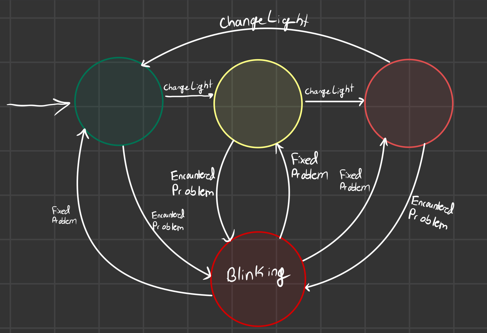

# Design Decisions & Tradeoffs

The traffic light finite state machine is based on the following image:

To implement this finite state machine, I used enums to represent states and transitions. This was convenient since there are only four states and four transitions in the traffic light example. I used a map to represent transitions between states but this isn't the most ideal solution since there are remaining if statements. The purpose of the map is to simplify code such as `if state is green and message = ChangeLight change to yellow` which gets messy even with four states. The transition table would be ideal in very simple a finite state machine where the `EncounteredProblem` transition didn't exist so there would be 0 if statements and it would be a circular loop. A better implementation of this pattern is to make abstract classes and use polymorphism to control the transitions on a state level instead of in the scope of the `StateMachine` class. This would eliminate my three if-statements not covered by my transition table. However, I decided that for this FSM, a transition table would be sufficient for representing the transitions and it was not complex enough to use abstractions.

_Note: this finite state machine only covers the traffic light for now, but I can easily adapt it to take arbitrary states and messages and store those as enums._

---

# API

- Instantiate: `StateMachine sm;`
- There are four states stored in an enum: `Green, Yellow, Red, BlinkingRed`

* testing mixed lists

- There are four messages stored in an enum: `ChangeLight, EncounteredProblem, FixedProblem, Print`
- _All methods are void_
- `StateMachine::handle(Message m)`, where `Message m` is the transition, handle transitions between states
- `StateMachine::restart()` returns the fsm to its default configuration where the current state is green
- My tests and more examples of the API are included in `test.cpp`

---

# Compiler

- clang++ C++14
